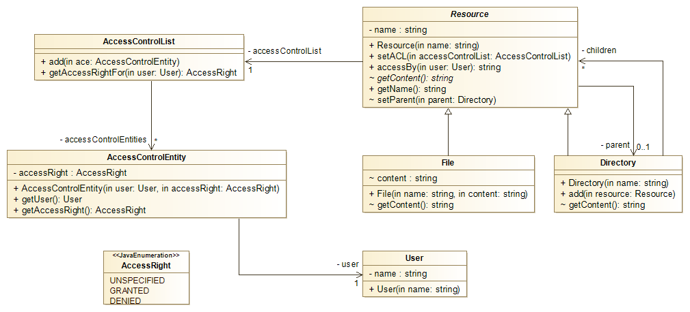
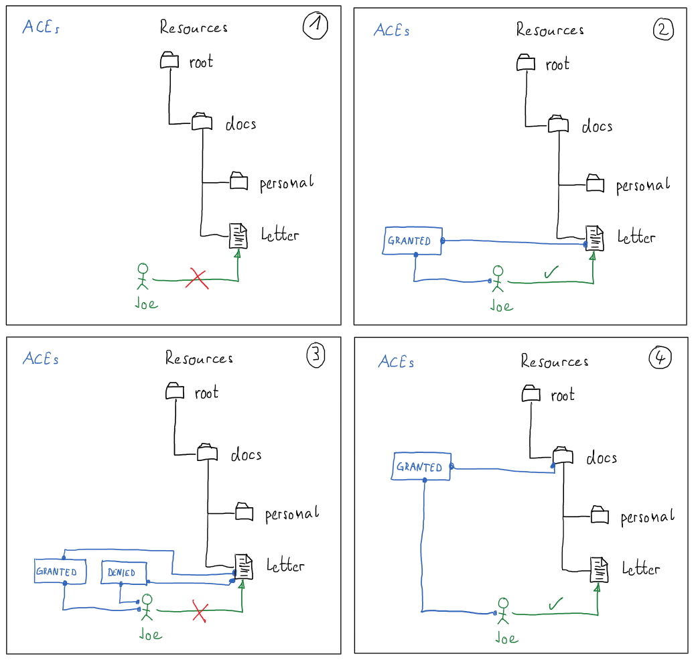
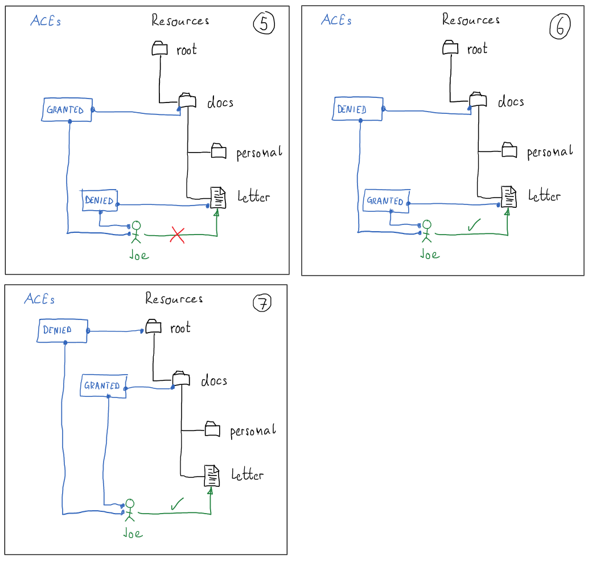

# Access Control
Access Control Lists (ACLs) are a very powerful means to grant or deny detailed access privileges on individual resources to users and groups. ACLs are used today in the most prevalent operating systems, as well as in any other system, where fine-grained control of access is required. An example of a commercial product using ACLs can be found under [SAP NetWeaver Development Infrastructure](https://help.sap.com/doc/saphelp_gbt10/1.0/de-DE/21/53882f3fee0243b6c774e26ebed880/content.htm?no_cache=true).

Two main features of ACLs are:
- inheritance of granted or denied access rights within a hierarchy of resources and groups
- built-in rules that govern the precedence of granted or denied access rights to resolve conflicting settings

In this task you will implement a few classes for a simplified ACL system.
In the following we talk about users instead of principals, about access rights instead of privileges and only about read access.

## Requirements
The following class diagram shows the required classes, their members and relationships. This diagram is to be considered binding.



### Class `Resource`

This is the abstract base class for directories and files. A directory may contain other directories and files, thus forming a tree structure.
A `Resource` object has always an associated `AccessControlList` object. Upon creation of a `Resource` object an empty `AccessControlList` object will be created and associated.

The `accessBy` method is the key method of the system. It allows a user to read the content of a resource, provided the process of access right resolution results in granted read access right. To decide whether access is granted the method consults the associated `AccessControlList` object. If the list is empty, this is interpreted as an access right of type `UNSPECIFEID`. The method goes then to the parent directory and looks up the associated `AccessControlList` object there. This process is continued until either an `AccessControlList` object containing an `AccessControlEntity` object of type `GRANTED` or `DENIED` is found, or the root directory is reached. If the root directory is reached and found to have an empty `AccessControlList` object, this is finally interpreted as an access right of type `UNSPECIFEID`.

Based on the outcome of this resolution process, the method returns the content of the resource or the String `Exception: Access denied`. If the outcome is `UNSPECIFEID`, access is also denied.
The content itself is retrieved through the abstract method `getContent`. For a directory its implementation returns a list of contained sub-directories and files. For files the implementation returns the file's content.

### Class `AccessControlList`
This class serves as container of `AccessControlEntity` objects. The method `getAccessRightFor` searches the list of associated `AccessControlEntity` objects for the one with the highest precedence for the given user (see rules section).

### Class `AccessControlEntity`
This class associates a `User` object with granted or denied read access right and represents an individual access right setting. The type `UNSPECIFIED` has the same effect, as if there were no `AccessControlEntity` object. On the other hand, there may be more than one `AccessControlEntity` objects for a particular user, even with contradictory settings (e.g. granted and denied at the same time).

### Class `User`
A user simply has a name.

## Rules
It is not mandatory to define ACLs for all resources. On the other hand, it is possible to define contradictory ACEs for the same resource. To solve these conflicts, the access rights (`GRANTED`, `DENIED`) are interpreted according to following rules:

1. Inheritance  
A resource of a lower hierarchy level inherits the access rights that have been assigned to a higher-level directory. 
1. Child before parent  
Access rights set directly on a resource overrule inherited access rights from parent directories, e.g. an inherited `DENIED` is overruled by a direct `GRANTED`. The same applies for access rights inherited from near parent directories and far parent directories: "Near" access rights overrule "far" access rights.
1. `DENIED` over `GRANTED`  
If there are conflicting settings for a particular user on one and the same resource, then `DENIED` takes precedence over `GRANTED` and `GRANTED` over `UNSPECIFIED`.

See the following examples for illustration of these rules. For simplicity, the `AccessControlList` objects are not shown.

 


### Legend
1. No ACEs on file `letter` --> Access right `UNSPECIFIED` --> no access
1. ACE `GRANTED` for user `Joe` on file `letter` --> access allowed
1. ACE `GRANTED` and `DENIED` for user `Joe` on file `letter` --> no access (rule 3)
1. ACE `GRANTED` for user `Joe` on directory `docs`, no ACE on file `letter` --> access allowed (rule 1)
1. ACE `GRANTED` for user `Joe` on directory `docs`, ACE `DENIED` for user `Joe` on file `letter` -->no  access (rule 2)
1. ACE `DENIED` for user `Joe` on directory `docs`, ACE `GRANTED` for user `Joe` on file `letter` --> access allowed (rule 2)
1. ACE `DENIED` for user `Joe` on directory `root`, ACE `GRANTED` for user `Joe` on directory `docs` --> access allowed (rule 2)

## Implementation
For the implementation it is recommended to proceed according to the following steps:

1. Implement skeletons for all classes, i.e. classes with instance variables and method headers, but empty method bodies (except for getters, setters and constructors)
1. Implement the `getContent` methods.
1. Complete the classes `AccessControlList` and `AccessControlEntity` according to the description in the requirements section. This includes rule 3 which is implemented by the method `getAccessRightFor` of the class `AccessControlList`.
1. Implement the method `accessBy` of the `Resource` class. In this step the method shall only look for ACLs on the actual resource.
1. Re-factor the method `accessBy` by implementing rule 1 and 2.

Validate your implementation against the provided unit tests.

There ia also a class `Main` provided, where you can see how the access control classes are used. If you run this class your implementation should produce the following output:

```
Exception: Access denied
Dear Bill, don't kill. Regards Joe
Exception: Access denied
Dear Bill, don't kill. Regards Joe
```

