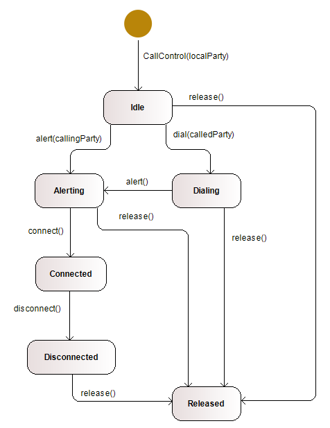

# Call Control


## Introduction

A call control is a subsystem usually found in (virtual) circuit switched telecommunication networks (e.g. plane old telephony service). Its purpose is to control the establishment and tear-down of an end-to-end connection between the communicating parties. Signaling protocols are used to exchange the necessary data between the involved devices. The implementation of such protocols leads to the implementation of state machines.

In this task we look at simplified call control from the perspective of a terminal equipment (e.g. a mobile phone).

## Tasks

### Phone Number Class
Write a class `PhoneNumber`.
A `PhoneNumber` consists of a country code, an area code and a subscriber number.

Examples:
- Country code: +41, 001
- Area code: 031, 981
- Subscriber number: 381 8132

The class should have a constructor to which the three codes can be passed as a string.
The constructor checks the country code and the area code and makes the following adjustments if necessary:
- Remove leading zeros in the country code and insert a leading plus (if not present).
- Remove any leading zeros in the area code.
- Insert a space after the third digit in the subscriber number (if not present).

The class should have a `toString()` method that returns the phone numbers in the following form:

`+41 31/381 8132`

The class is immutable.

### Call Data Record class
Write a class `CallDataRecord`. This class is used to collect the billing data of a phone call.
A call data record contains the phone numbers of the calling party and the called party,
a timestamp for the time when the connection has been switched through and a timestamp for the time when the connection was disconnected.

The class has
- a constructor to which the two phone numbers can be passed.
- getters for all four stored informations.
- a method `establish()`. This method sets the timestamp of the switch-through to the current time (incl. date), provided that
  the connection has not yet been switched through.
- a method `disconnect()`. This method sets the timestamp of the disconnection to the current time (incl. date), provided that
  the connection has previously been switched through, but has not yet been disconnected.
- a method `toString()`. Depending on the state of the `CallDataRecord`, this method returns a string representation of the record, e.g.:

```
   calling: +41 31/381 8132, called: +1 982/543 1201, start: not yet established
   calling: +41 31/381 8132, called: +1 982/543 1201, start: 2019-07-07T15:10:36.470049400, end: still established
   calling: +41 31/381 8132, called: +1 982/543 1201, start: 2019-07-07T15:10:36.470049400, end: 2019-07-07T15:10:38.493519800
```

For implementation, use the class `PhoneNumber` (see previous task) and the class `LocalDateTime` (see Java API Doc).

### Call Control Class
Write a class `CallControl`. This class controls a phone call, which can either be incoming or outgoing. Thereby, a call will pass through the following states (UML state diagram):



Remarks:
- Only the indicated transitions are allowed. Invocations of other methods, while being in an inappropriate state will be ignored.
- Outgoing calls pass through the state `Dialing`, while incoming calls proceed directly to the state `Alerting`.
- `localParty`: The phone number of the local subscriber (the call is always viewed from this perspective).
- `calledParty`: For an outgoing call, the phone number of the called party at the other end.
- `callingParty`: For an incoming call, the phone number of the calling party at the other end.

The `CallControl` class shall maintain the actual state in an instance variable. The actual state may be accessed through a getter method.

The methods `dial(calledParty)` and `alerting(callingParty)` create a `CallDataRecord`. A reference to this can be retrieved by the method `getCDR()`.
The `connect()` method calls the `establish()` method on the `CallDataRecord`.
The `disconnect()` method calls the `disconnect()` method on the `CallDataRecord`.

For the implementation use the classes `PhoneNumber` and `CallDataRecord` (see preceding tasks).

### Unit Tests
Make sure that the provided unit tests are satisfied by your classes.
